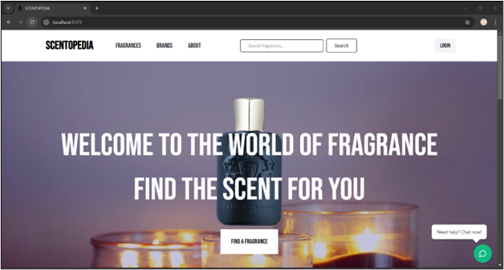
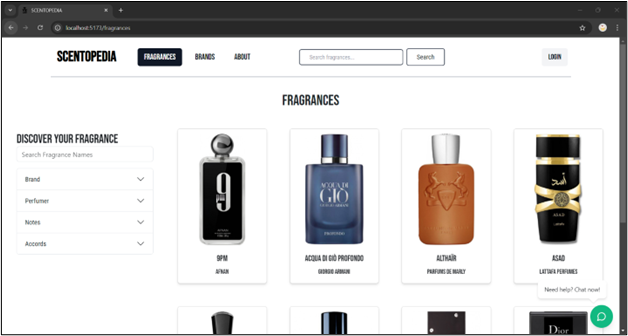
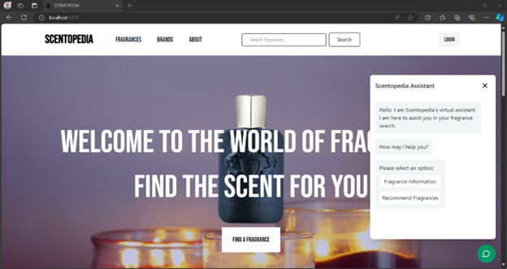
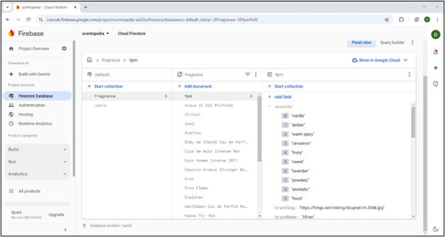

# 🌸 Scentopedia – Capstone Project

**Scentopedia** is a full-stack web application designed to help users explore fragrances, save their favorites, create wishlists, create user accounts, learn more about fragrance families, accords, and scent profiles, and locate nearby stores.

## 🛠️ Tech Stack
- **Frontend**: React, TypeScript, Vite
- **Backend/Database**: Firebase Firestore
- **UI Design**: Lucide Icons, Custom CSS

## 🌟 Features
- User authentication and account management
- Searchable fragrance database
- Chatbot assistant for user guidance
- Store locator with geolocation capabilities
- Information on fragrance accords, notes, etc.

## 🧠 Key Contributions
- Developed UX/UI components and design system using Lucide
- Built an interactive chatbot interface
- Managed Firestore integration and queries

## 🚀 How to Run Locally
**1. Clone the repository:**
  ```bash
  git clone https://github.com/dariusrichardson36/Scentopedia.git
  ```

**2. Navigate to the project directory:**
  ```bash
  cd Scentopedia
  ```

**3. Install dependencies:**
  ```bash
  npm install
  ```

**4. Create a `.env` file with your Firebase configuration. Inside the `.env`, you will enter your Firebase credentials:**
  ```bash
  VITE_API_KEY=your_api_key
  VITE_AUTH_DOMAIN=your_project_id.firebaseapp.com
  VITE_PROJECT_ID=your_project_id
  VITE_STORAGE_BUCKET=your_project_id.appspot.com
  VITE_MESSAGING_SENDER_ID=your_messaging_sender_id
  VITE_APP_ID=your_app_id
  ```

**5. Start the development server:**
  ```bash
  npm run dev
  ```

## 📸 Screenshots

### 🏠 Homepage Preview  


### 🔍 Fragrance Page  


### ✏️ Search Bar Functionality  


### 💬 Chatbot Assistant  


### 🔧 Firebase Backend Setup  



## 📫 Contact
**Darius Richardson**  
- [LinkedIn](https://www.linkedin.com/in/darius-richardson-ga-tech)  
- [Email Me](mailto:darius.richardson36@yahoo.com)
